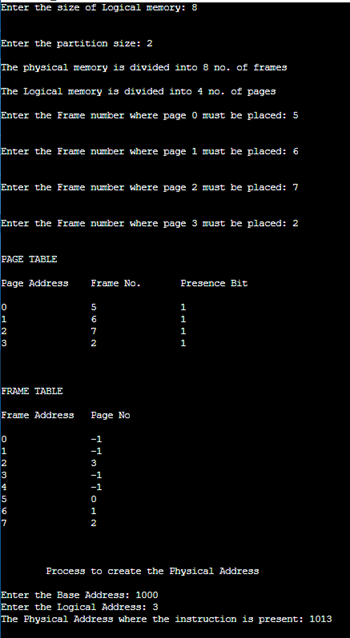

# OS-EX.9-IMPLEMENTATION-OF-PAGING---MEMORY-MANAGEMENT-

## AIM:
To implement paging memory management in C.

## ALGORITHM:
Step 1: Read all the necessary input from the keyboard.

Step 2: Pages - Logical memory is broken into fixed - sized blocks.

Step 3: Frames – Physical memory is broken into fixed – sized blocks.

Step 4: Calculate the physical address using the following

Physical address = ( Frame number * Frame size ) + offset

Step 5: Display the physical address.

Step 6: Stop the process.
## PROGRAM:
~~~
#include <stdio.h>
struct pstruct
{
    int fno;
    int pbit;
} ptable[10];
int pmsize, lmsize, psize, frame, page, ftable[20], frameno;
void info()
{
    printf("\n\nMEMORY MANAGEMENT USING PAGING\n\n");
    printf("\n\nEnter the Size of Physical memory: ");
    scanf("%d", &pmsize);
    printf("\n\nEnter the size of Logical memory: ");
    scanf("%d", &lmsize);
    printf("\n\nEnter the partition size: ");
    scanf("%d", &psize);
    frame = pmsize / psize;
    page = lmsize / psize;
    printf("\nThe physical memory is divided into %d no. of frames\n", frame);
    printf("\nThe Logical memory is divided into %d no. of pages", page);
}

void assign()
{
    int i;
    for (i = 0; i < page; i++)
    {
        ptable[i].fno = -1;
        ptable[i].pbit = -1;
    }
    for (i = 0; i < frame; i++)
        ftable[i] = -1;
    for (i = 0; i < page; i++)
    {
        printf("\n\nEnter the Frame number where page %d must be placed: ", i);
        scanf("%d", &frameno);
        ftable[frameno] = i;
        if (ptable[i].pbit == -1)
        {
            ptable[i].fno = frameno;
            ptable[i].pbit = 1;
        }
    }
    printf("\n\nPAGE TABLE\n\n");
    printf("Page Address\tFrame No.\tPresence Bit\n\n");
    for (i = 0; i < page; i++)
        printf("%d\t\t%d\t\t%d\n", i, ptable[i].fno, ptable[i].pbit);
    printf("\n\n\nFRAME TABLE\n\n");
    printf("Frame Address\tPage No\n\n");
    for (i = 0; i < frame; i++)
        printf("%d\t\t%d\n", i, ftable[i]);
}

void cphyaddr()
{
    int laddr, paddr, disp, phyaddr, baddr;
    printf("\n\n\n\tProcess to create the Physical Address\n\n");
    printf("Enter the Base Address: ");
    scanf("%d", &baddr);
    printf("Enter the Logical Address: ");
    scanf("%d", &laddr);
    paddr = laddr / psize;
    disp = laddr % psize;
    if (ptable[paddr].pbit == 1)
        phyaddr = baddr + (ptable[paddr].fno * psize) + disp;
    printf("The Physical Address where the instruction is present: %d", phyaddr);
}
int main()
{
    info();
    assign();
    cphyaddr();
    return 0;
}

~~~
## OUTPUT:

## RESULT:
Thus the implementation of paging memory management in C is successfully done.

